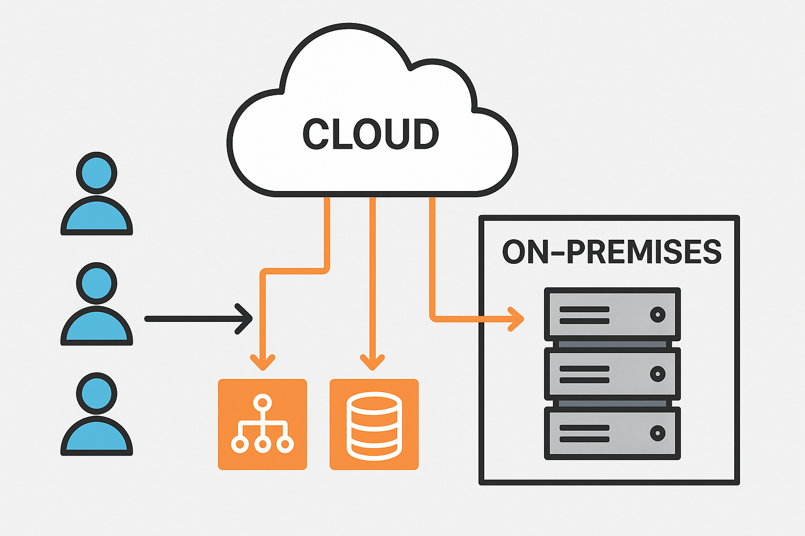

# 🧰 IT Automation Toolkit

A collection of real-world PowerShell scripts, templates, and configurations designed to streamline IT operations and demonstrate practical automation in enterprise environments.

---

## 🚀 Overview

This toolkit highlights how IT managers can automate common administrative workflows, including user onboarding, offboarding, compliance reporting, and scheduled backups, while maintaining visibility through dashboards and audit logs.

The project emphasizes **automation, security, and scalability**, showing how a modern IT department can reduce manual effort and improve consistency.

---

## 🏗️ Features

- **Automated User Onboarding**  
  Creates new users in Azure AD and Okta, applies Intune device policies, and licenses Microsoft 365 accounts automatically.

- **Secure Offboarding Workflow**  
  Disables accounts, removes device access, and archives data to cloud storage with minimal manual steps.

- **Scheduled Backups**  
  Automates server or SharePoint data backups and verifies integrity via hash comparison.

- **Inventory Reporting**  
  Generates up-to-date CSV and Power BI dashboards with device, license, and compliance data.

---

## 🧩 Technologies Used

- **Scripting & Automation:** PowerShell, Python  
- **Cloud & Identity:** Azure AD, Intune, Okta, Microsoft 365  
- **Data & Visualization:** Power BI, Excel, Log Analytics  
- **Security & Compliance:** Conditional Access, MFA, Audit Logging

---

## 🗂️ Project Structure

```
/scripts      → PowerShell scripts for automation
/config       → JSON templates for Intune, Okta, and policies
/docs         → Documentation, architecture diagrams, changelog
/dashboards   → Sample Power BI dashboards
/logs         → Example output and logs
/reports      → Generated CSV/Excel reports (gitignored by default)
```

---

## 🧠 Architecture



**Workflow Summary**
1. Scripts are triggered via scheduled tasks or Azure Automation.
2. API calls manage users, devices, and policies across Azure, Intune, and Okta.
3. Logs and reports are generated for compliance tracking.
4. Power BI visualizes results for IT leadership and audits.

---

## 🧩 Example Commands

```powershell
# Run onboarding workflow
.\scripts\onboarding.ps1 -UserList ".\config\new_users.csv"

# Generate inventory report
.\scripts\inventory_report.ps1 -ExportPath ".\reports\inventory.csv"
```

---

## 🧱 Future Enhancements
- Integration with ServiceNow and Jira for ticket automation  
- Slack or Teams bot for real-time workflow status  
- API-based license optimization tracking  

---

## 👤 Author

**Claney**  
IT Manager & Consultant | Cloud, Automation, and Infrastructure Design  
🔗 LinkedIn: https://www.linkedin.com/in/christopher-laney-b085a068 
🔗 Linktree: https://linktr.ee/gatica.unlimited

---

## 🪪 License
This project is released under the MIT License. You’re free to use and modify it for learning and demonstration purposes.
