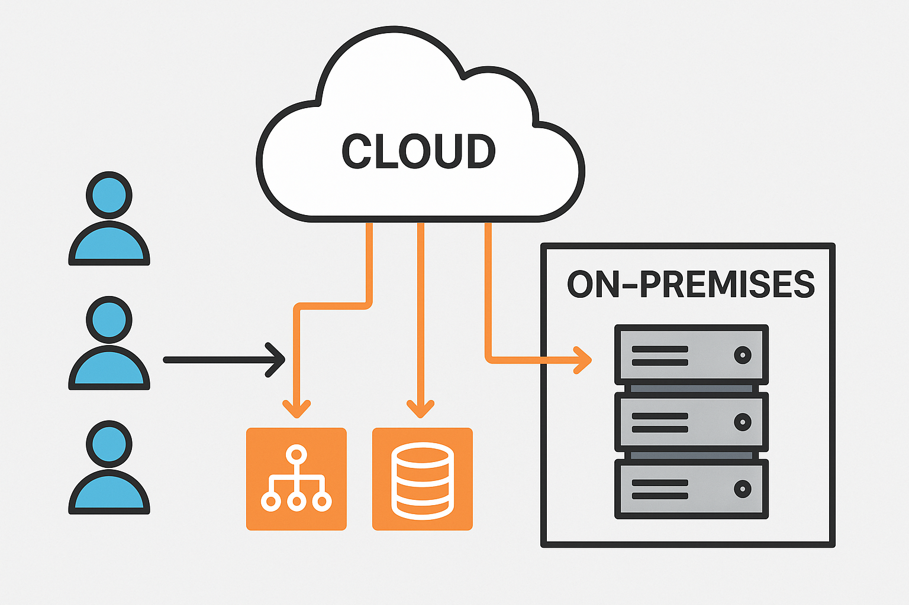

# 🧰 IT Automation Toolkit
<p align="center">
  
</p>


A collection of real-world PowerShell scripts, templates, and configurations designed to streamline IT operations and demonstrate practical automation in enterprise environments.

---

## 🚀 Overview

This toolkit highlights how IT managers can automate common administrative workflows, including user onboarding, offboarding, compliance reporting, and scheduled backups, while maintaining visibility through dashboards and audit logs.

The project emphasizes **automation, security, and scalability**, showing how a modern IT department can reduce manual effort and improve consistency.

---

## 🏗️ Features

- **Automated User Onboarding**  
  Creates new users in Azure AD and Okta, applies Intune device policies, and licenses Microsoft 365 accounts automatically.

- **Secure Offboarding Workflow**  
  Disables accounts, removes device access, and archives data to cloud storage with minimal manual steps.

- **Scheduled Backups**  
  Automates server or SharePoint data backups and verifies integrity via hash comparison.

- **Inventory Reporting**  
  Generates up-to-date CSV and Power BI dashboards with device, license, and compliance data.

---

## 🧩 Technologies Used

- **Scripting & Automation:** PowerShell, Python  
- **Cloud & Identity:** Azure AD, Intune, Okta, Microsoft 365  
- **Data & Visualization:** Power BI, Excel, Log Analytics  
- **Security & Compliance:** Conditional Access, MFA, Audit Logging

---

## 🗂️ Project Structure

```
/scripts      → PowerShell scripts for automation
/config       → JSON templates for Intune, Okta, and policies
/docs         → Documentation, architecture diagrams, changelog
/dashboards   → Sample Power BI dashboards
/logs         → Example output and logs
/reports      → Generated CSV/Excel reports (gitignored by default)
```

---

## 🧠 Architecture



**Workflow Summary**
1. Scripts are triggered via scheduled tasks or Azure Automation.
2. API calls manage users, devices, and policies across Azure, Intune, and Okta.
3. Logs and reports are generated for compliance tracking.
4. Power BI visualizes results for IT leadership and audits.

---

## 🧩 Example Commands

```powershell
# Run onboarding workflow
.\scripts\identity\onboarding.ps1 -UserList ".\config\new_users.csv" -ValidateOnly
.\scripts\identity\onboarding.ps1 -UserList ".\config\new_users.csv" -WhatIf

# Generate inventory report
.\scripts\reporting\inventory_report.ps1 -ExportPath ".\reports\inventory.csv"
```

---

## ⚡ Quickstart

See [docs/quickstart.md](docs/quickstart.md) for a safe local walkthrough, including syntax validation, onboarding preview mode, optional server checks, and report generation.

For backup and restore workflows, see [docs/backup_restore.md](docs/backup_restore.md).

For Intune policy validation and deployment, see [docs/intune_policy_templates.md](docs/intune_policy_templates.md).

For dashboard generation and Power BI source guidance, see [docs/dashboard_guidance.md](docs/dashboard_guidance.md).
The repository also includes sanitized sample CSVs under `samples/reports` for a no-tenant dashboard demo.
Power BI starter source notes, Power Query snippets, and DAX measures live under `dashboards/powerbi`.

---

## ✅ Validation

This repository includes a GitHub Actions workflow that checks PowerShell syntax, runs Pester parser tests, and runs PSScriptAnalyzer for error-level findings.

You can run the no-dependency parser check locally with:

```powershell
Get-ChildItem .\scripts -Recurse -Filter *.ps1 | ForEach-Object {
  $errors = $null
  [System.Management.Automation.Language.Parser]::ParseFile($_.FullName, [ref]$null, [ref]$errors) | Out-Null
  $errors | ForEach-Object { "{0}:{1}: {2}" -f $_.Extent.File, $_.Extent.StartLineNumber, $_.Message }
}
```

---

## 🔐 Safety Notes

- Start with `-WhatIf` on scripts that change users, licenses, groups, policies, or files.
- Onboarding reports omit generated temporary passwords by default. Only enable password export for controlled demos or secure handoff workflows.
- Store secrets in environment variables, Azure Key Vault, or your enterprise vault. Do not commit live tokens, webhook URLs, or connection strings.
- Review permissions before running Graph, Intune, Exchange, Okta, or Azure automation in production tenants.
- Treat sample config files as templates and replace tenant-specific values before use.

---

## 🧱 Future Enhancements
- Integration with ServiceNow and Jira for ticket automation  
- Slack or Teams bot for real-time workflow status  
- API-based license optimization tracking  

---

## 👤 Author

**Claney**  
IT Manager & Consultant | Cloud, Automation, and Infrastructure Design  
🔗 LinkedIn: https://www.linkedin.com/in/christopher-laney-b085a068 
🔗 Linktree: https://linktr.ee/gatica.unlimited

---

## 🪪 License
This project is released under the MIT License. You’re free to use and modify it for learning and demonstration purposes.
